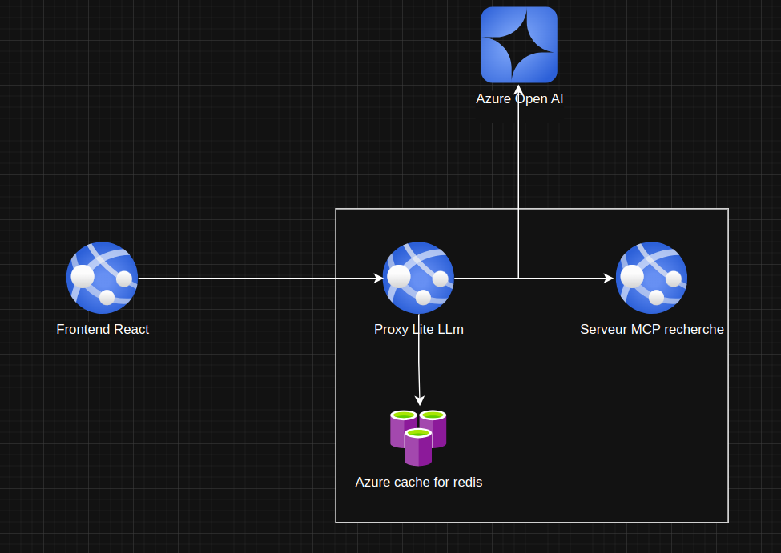

# Description du projet et de l’architecture

Dans le cadre de ce projet, la fonctionnalité attendue était d’avoir un chatbot capable d’accéder à Internet.

Pour le réaliser, j’ai décidé de partir sur une architecture modulaire utilisant le protocole MCP (Modèle Contexte Protocole). Ce choix technique permettra à l’entreprise X, par la suite, d’ajouter aisément de nouvelles fonctionnalités à son chatbot, telles que la communication avec des bases de données SQL, un système de RAG, et bien d’autres encore.

La recherche sur Internet se base sur l’API gratuite de DuckDuckGo, et le LLM est exploité via l’inférence sur la plateforme Groq. J’y ai ajouté un rate limit à l’aide de la bibliothèque LangChain afin de pouvoir fonctionner avec le plan gratuit.

Lors du déploiement de la plateforme, la principale amélioration à apporter sera le moteur de recherche : en effet, l’API gratuite DuckDuckGo présente souvent des lacunes dans la pertinence des résultats.

Parmi les services à considérer, on pourra explorer Jina.ai avec le SerpAPI, ou encore Tavily.

Concernant les LLM, j’ai décidé de mettre en place un LiteLLM Proxy, ce qui permettra à l’entreprise de gérer en un seul point les accès aux différents LLM et de surveiller leur coût d’utilisation. LiteLLM Proxy offre également une passerelle entre les LLM et les services MCP, facilitant l’ajout très rapide de nouveaux services.

De plus, LiteLLM permet de créer une solution complète en y intégrant différents systèmes de cache tels que Redis ou des caches sémantiques avec Qdrant, réduisant ainsi la consommation de requêtes auprès des LLM. Il nous permet également de gérer les autorisations par utilisateur et de mettre en place des limites de débit.

Un cache Azure Cache for Redis pourra être déployé pour réduire la charge sur les LLM.  


# Dossier

- **backend** : comprend les fichiers Python utiles au back‑end de l’application.  
- **frontend** : comprend les fichiers du front‑end et un Dockerfile permettant de lancer l’application après build, avec Nginx.  
- **bonus** : contient le script dédié à la partie bonus.

Le back‑end peut être lancé en mode FastAPI à l’aide du Dockerfile situé à la racine du projet ; il peut également fonctionner en mode serveur MCP en exécutant le fichier Python `app_mcp.py`.  


# Agent

Pour créer l’agent de recherche, j’ai d’abord souhaité me baser sur le code fourni par Google et LangGraph :  
https://github.com/google-gemini/gemini-fullstack-langgraph-quickstart

Cependant, après avoir adapté ce code pour fonctionner avec OpenRouter, je me suis rendu compte que la solution était trop « overkill » pour des requêtes simples. En effet, les modèles plus petits, tels que `qwen/qwen-2.5-32b-instruct:free`, ont tendance à ne pas se contenter de la première réponse, alors que celle‑ci est déjà suffisante. Cela entraîne une consommation excessive de tokens pour une question basique.

C’est pourquoi j’ai décidé d’implémenter mon propre workflow de recherche, qui permet de mieux contrôler la consommation de tokens tout en conservant une grande modularité pour d’éventuelles améliorations.

Pour lire une page Internet et la formater en Markdown, j’ai mis en place un script utilisant l’API Jina Reader pour effectuer la conversion.  


# Module Azure

Voici la liste des modules Azure que j’utiliserai et les raisons de leur usage :

- **Azure App Service** : déploiement des différents conteneurs Docker de l’application.  
- **Azure Container Registry** : stockage des images Docker.  
- **Azure Monitor** : supervision et remontée de métriques de l’application.  
- **Microsoft Cost Management** : suivi et optimisation des coûts de l’infrastructure.  
- **Microsoft Entra ID** : authentification SSO pour les membres de l’entreprise.  
- **VNets et NSGs** : isolation et sécurisation des communications entre conteneurs — notamment entre le front‑end et le serveur LiteLLM, ainsi qu’entre LiteLLM et les différents serveurs MCP.  
- **Azure Key Vault** : stockage sécurisé des clés d’API.  
- **Auto‑scaling** : adaptation automatique de la capacité de l’application en fonction de la charge.  
- **Azure Cache for Redis** : mise en cache des requêtes fréquentes aux LLM afin de réduire leur consommation.  
- **Azure OpenAI Service** : accès aux modèles de langage pour le traitement et la génération de texte.  


# Schema



# Estimation des coûts

Si l’on considère que :  
- l’entreprise est une petite structure française d’environ 40 employés ;  
- l’application n’a pas besoin de tourner 24 h/24, mais uniquement les jours de semaine (9 h/jour × 5 jours × 4 semaines = 180 h/mois) ;

J’ai réalisé une estimation des coûts à l’aide du site : https://azure.microsoft.com/fr-fr/pricing/calculator/

- **App Service** (3 instances B3 en France, 7 Go de RAM, 180 h/mois) : 37,80 $  
- **Azure Container Registry** (plan Standard) : 20 $/mois  
- **Azure Monitor** : à déterminer  
- **Microsoft Cost Management** : gratuit  
- **Microsoft Entra ID** : non inclus (déjà en place pour d’autres services)  
- **Réseau virtuel managé** (1 VNet) : 14,60 $  
- **Azure Cache for Redis** : 33,12 $  
- **Azure OpenAI Service** (≈ 1 million de tokens input+output/mois) : 750 $

**Total estimé : 855,52 $ par mois**

> On pourra réduire les coûts en utilisant des modèles plus petits et opensource.  

# Sécurité

Pour la sécurité de l'application, plusieurs éléments seront mis en place :

- Création d'un réseau privé pour l'application.  
- Mise en place d'une gestion du CORS entre le frontend et le proxy LiteLLM afin que seul le frontend puisse appeler l'API. On pourra également mettre en place des droits particuliers au niveau des machines pour encore mieux sécuriser l'accès.  
- L'application web ne sera pas déployée sur Internet, mais uniquement en interne.  
- Une authentification par SSO sera requise pour se connecter au frontend.  
- Les tokens seront évidemment stockés dans Azure Key Vault.


# Mise en production

Pour mettre en production l'application, nous mettrons en place un pipeline CI/CD avec GitLab ou GitHub, selon l'outil utilisé par l'entreprise.

Des premières GitLab/GitHub Actions seront déclenchées lors d'une modification du code dans la branche `main`. Elles lanceront une série de tests à l'aide de **Pytest** pour le code Python et de **Jest** pour le JavaScript, puis effectueront le **build des images Docker**, avant de les pousser dans **Azure Container Registry**.

Nous utiliserons **Azure Monitor** pour surveiller les logs, en mettant en place des mécanismes pour faire remonter les erreurs par email à l’administrateur de l’application.

L’infrastructure sera déployée à l’aide d’outils comme **Terraform**.


# Bonus 
## vlm
Utilisation du modèle `HuggingFaceTB/SmolVLM-256M-Instruct` afin de pouvoir fonctionner sur Google Colab gratuit.

### Pour utiliser le script bonus :

```bash
cd bonus
python main.py --image chemin/vers/image.jpg --action (ocr|describe)
```
- Lorsque `--action=ocr`, le modèle extrait le texte présent dans l'image.
- Lorsque `--action=describe`, le modèle génère une description de l'image.

## Embedding VLM

Mon approche est la suivante :

- Dans un premier temps, un service se charge de convertir les documents en images.
- À partir de ces images, plusieurs solutions sont possibles : soit utiliser des méthodes DSE (Document Screenshot Embedding), soit utiliser une approche de type *Contextualized Late Interaction* telle que **ColQwen**. J'ai choisi d'utiliser **ColQwen** car elle présente actuellement de meilleurs résultats.
- Un autre service se charge ensuite de créer les embeddings pour les images et de les stocker dans une base vectorielle. J'ai choisi **Qdrant** comme base vectorielle, car elle offre un excellent support pour la gestion de *multi-vecteurs*, produits par les approches *Contextualized Late Interaction*. Ce service utilise l’approche détaillée sur le site de Qdrant pour créer un pipeline scalable :   https://qdrant.tech/documentation/advanced-tutorials/pdf-retrieval-at-scale/
- Ensuite, je crée un serveur **MCP** qui expose une fonction prenant en paramètre une requête (`query`), un nombre de documents à retourner, et renvoie les images les plus pertinentes selon la recherche.
- Enfin, je connecte ce serveur MCP au **proxy Litellm**, ce qui me permet d’ajouter ce nouvel outil à l’outil de recherche web précédemment développé. Le serveur peut alors envoyer au VLM les documents les plus pertinents pour générer une réponse.
